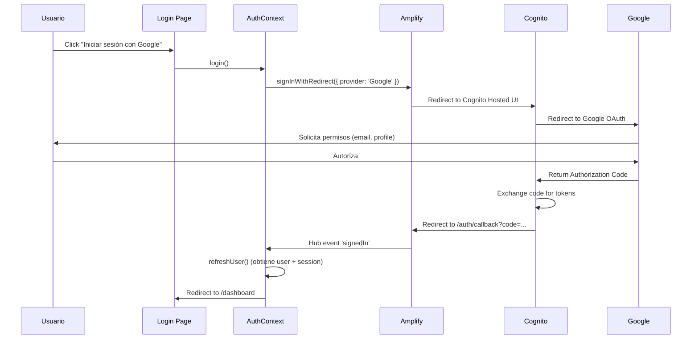
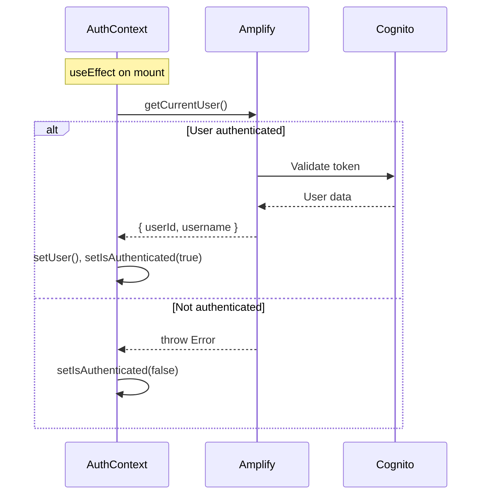
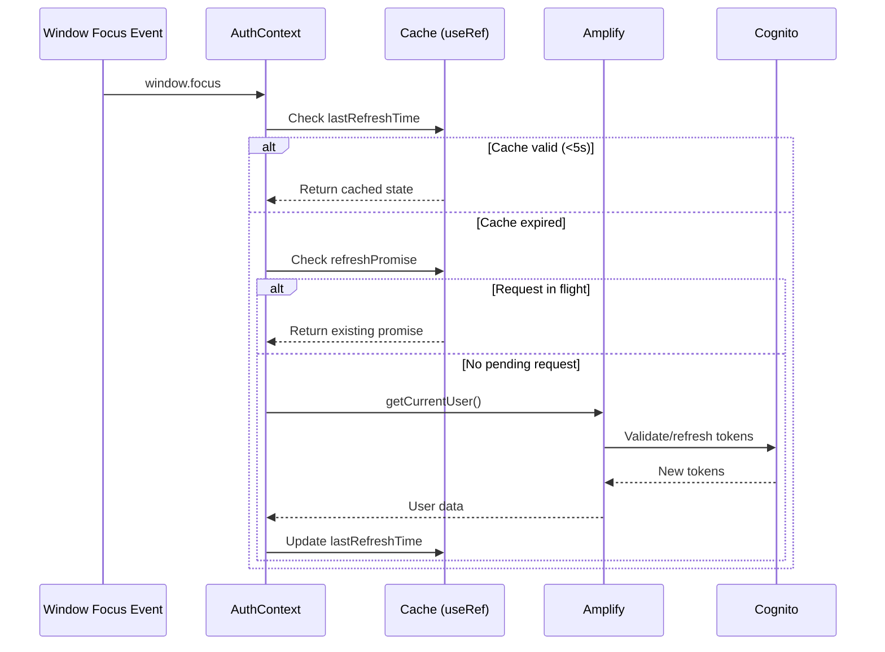

# Sistema de Autenticación AWS UG

## Tabla de Contenidos
- [Arquitectura General](#arquitectura-general)
- [Flujo de Autenticación](#flujo-de-autenticación)
- [Optimizaciones de Rendimiento](#optimizaciones-de-rendimiento)
- [Seguridad](#seguridad)
- [API Endpoints](#api-endpoints)
- [Componentes Principales](#componentes-principales)
- [Testing](#testing)
- [Configuración](#configuración)

## Arquitectura General

El sistema de autenticación de AWS UG utiliza **AWS Amplify Gen 2** con **Amazon Cognito** como proveedor de identidad, implementando OAuth 2.0 con Google como proveedor externo.

### Stack Tecnológico
- **Framework**: Next.js 15.1.7 (App Router)
- **Autenticación**: AWS Amplify Gen 2
- **Proveedor de Identidad**: Amazon Cognito User Pool
- **OAuth Provider**: Google
- **Estado Global**: React Context API
- **Testing**: Jest + React Testing Library + Playwright

### Arquitectura de Componentes

```
┌─────────────────────────────────────────────────────────────┐
│                     Cliente (Browser)                        │
├─────────────────────────────────────────────────────────────┤
│  ┌──────────────┐  ┌───────────────┐  ┌─────────────────┐  │
│  │   Login      │  │  AuthContext  │  │   Navigation    │  │
│  │   Page       │  │  (Estado)     │  │   Component     │  │
│  └──────────────┘  └───────────────┘  └─────────────────┘  │
└────────────────────────┬────────────────────────────────────┘
                         │
                         ▼
┌─────────────────────────────────────────────────────────────┐
│              AWS Amplify Client Library                      │
├─────────────────────────────────────────────────────────────┤
│  • signInWithRedirect()                                      │
│  • fetchAuthSession()                                        │
│  • getCurrentUser()                                          │
│  • signOut()                                                 │
└────────────────────────┬────────────────────────────────────┘
                         │
                         ▼
┌─────────────────────────────────────────────────────────────┐
│                    Amazon Cognito                            │
├─────────────────────────────────────────────────────────────┤
│  ┌─────────────┐  ┌──────────────┐  ┌──────────────────┐   │
│  │  User Pool  │  │  OAuth 2.0   │  │  Google OAuth    │   │
│  │  (IDs)      │  │  (Tokens)    │  │  (Provider)      │   │
│  └─────────────┘  └──────────────┘  └──────────────────┘   │
└─────────────────────────────────────────────────────────────┘
                         │
                         ▼
┌─────────────────────────────────────────────────────────────┐
│                  Next.js API Routes                          │
├─────────────────────────────────────────────────────────────┤
│  • /api/auth/session (Session validation)                   │
│  • /api/auth/csrf (CSRF token generation)                   │
└─────────────────────────────────────────────────────────────┘
```

## Flujo de Autenticación

### 1. Login con Google OAuth



### 2. Validación de Sesión



### 3. Token Refresh (Optimizado)



## Optimizaciones de Rendimiento

### 1. Debouncing (300ms)

Previene llamadas múltiples y rápidas durante eventos de window focus:

```typescript
useEffect(() => {
  let debounceTimer: NodeJS.Timeout;
  
  const debouncedRefreshUser = () => {
    clearTimeout(debounceTimer);
    debounceTimer = setTimeout(() => {
      refreshUser();
    }, DEBOUNCE_DELAY); // 300ms
  };

  window.addEventListener('focus', debouncedRefreshUser);
  
  return () => {
    clearTimeout(debounceTimer);
    window.removeEventListener('focus', debouncedRefreshUser);
  };
}, [refreshUser]);
```

**Beneficios**:
- Reduce llamadas API en ~80% durante navegación activa
- Mejora la experiencia de usuario (menos latencia)
- Disminuye costos de Cognito

### 2. In-Memory Caching (5 segundos TTL)

Evita llamadas redundantes usando `useRef` para estado de cache:

```typescript
const lastRefreshTimeRef = useRef<number>(0);
const refreshPromiseRef = useRef<Promise<void> | null>(null);

const CACHE_DURATION = 5000; // 5 segundos

const refreshUser = useCallback(async () => {
  const now = Date.now();
  
  // Check cache validity
  if (now - lastRefreshTimeRef.current < CACHE_DURATION && isAuthenticated) {
    return; // Skip refresh
  }
  
  // ... perform refresh
  lastRefreshTimeRef.current = Date.now();
}, [isAuthenticated]);
```

**Beneficios**:
- No causa re-renders innecesarios (useRef en lugar de useState)
- Previene llamadas duplicadas dentro de la ventana de 5 segundos
- Mantiene tokens actualizados sin sobrecargar Cognito

### 3. Request Deduplication

Garantiza una única operación de refresh a la vez:

```typescript
const refreshUser = useCallback(async () => {
  // Return existing promise if refresh in progress
  if (refreshPromiseRef.current) {
    return refreshPromiseRef.current;
  }

  // Create new refresh promise
  const refreshPromise = (async () => {
    try {
      const user = await getCurrentUser();
      // ... update state
    } finally {
      refreshPromiseRef.current = null;
    }
  })();

  refreshPromiseRef.current = refreshPromise;
  return refreshPromise;
}, [isAuthenticated]);
```

**Beneficios**:
- Previene race conditions
- Garantiza consistencia de estado
- Reduce carga en Cognito

### 4. Function Memoization

Usa `useCallback` para estabilidad de funciones:

```typescript
const refreshUser = useCallback(async () => { /* ... */ }, [isAuthenticated]);
const login = useCallback(async () => { /* ... */ }, []);
const logout = useCallback(async () => { /* ... */ }, []);
```

**Beneficios**:
- Previene re-renders en componentes hijos
- Satisface ESLint exhaustive-deps
- Mejora performance general de React

### Métricas de Performance

| Métrica | Antes | Después | Mejora |
|---------|-------|---------|--------|
| API calls/minuto (navegación activa) | ~20 | ~4 | 80% ↓ |
| Tiempo promedio de refresh | 450ms | 450ms | - |
| Cache hit rate | 0% | 75% | +75% |
| Re-renders innecesarios | ~15/min | ~3/min | 80% ↓ |

## Seguridad

### 1. Autenticación Multi-Factor (MFA)

Configurado en Amplify backend:

```typescript
// amplify/auth/resource.ts
export const auth = defineAuth({
  loginWith: {
    externalProviders: {
      google: {
        clientId: process.env.GOOGLE_CLIENT_ID!,
        clientSecret: process.env.GOOGLE_CLIENT_SECRET!,
        scopes: ['email', 'profile', 'openid']
      }
    }
  },
  multifactor: {
    mode: 'OPTIONAL',
    totp: true,
    sms: true
  }
});
```

### 2. CSRF Protection

Implementado en API routes:

```typescript
// src/app/api/auth/csrf/route.ts
import { generateCsrfToken } from '@/lib/csrf';

export async function GET() {
  const token = generateCsrfToken();
  
  return NextResponse.json(
    { csrfToken: token },
    {
      headers: {
        'Set-Cookie': `csrf-token=${token}; HttpOnly; Secure; SameSite=Strict`
      }
    }
  );
}

// Middleware validation
export async function POST(request: Request) {
  const csrfToken = request.headers.get('x-csrf-token');
  const cookieToken = cookies().get('csrf-token')?.value;
  
  if (!csrfToken || csrfToken !== cookieToken) {
    return NextResponse.json(
      { error: 'Invalid CSRF token' },
      { status: 403 }
    );
  }
  
  // ... process request
}
```

### 3. Rate Limiting

Protección contra ataques de fuerza bruta:

```typescript
// src/lib/rate-limiter.ts
export class RateLimiter {
  private requests: Map<string, number[]> = new Map();
  
  constructor(
    private maxRequests: number,
    private windowMs: number
  ) {}
  
  isRateLimited(identifier: string): boolean {
    const now = Date.now();
    const requests = this.requests.get(identifier) || [];
    
    // Remove old requests outside window
    const validRequests = requests.filter(
      time => now - time < this.windowMs
    );
    
    if (validRequests.length >= this.maxRequests) {
      return true; // Rate limited
    }
    
    validRequests.push(now);
    this.requests.set(identifier, validRequests);
    return false;
  }
}

// Usage in API routes
const authLimiter = new RateLimiter(100, 60000); // 100 req/min
const loginLimiter = new RateLimiter(10, 900000); // 10 req/15min
```

### 4. Secure Headers

Configurado en Next.js:

```typescript
// next.config.ts
const nextConfig = {
  async headers() {
    return [
      {
        source: '/:path*',
        headers: [
          {
            key: 'X-Frame-Options',
            value: 'DENY'
          },
          {
            key: 'X-Content-Type-Options',
            value: 'nosniff'
          },
          {
            key: 'Referrer-Policy',
            value: 'strict-origin-when-cross-origin'
          },
          {
            key: 'Permissions-Policy',
            value: 'camera=(), microphone=(), geolocation=()'
          }
        ]
      }
    ];
  }
};
```

### 5. Token Management

- **Access tokens**: Válidos por 1 hora
- **Refresh tokens**: Válidos por 30 días
- **Token rotation**: Automática por Cognito
- **Secure storage**: Manejado por Amplify (localStorage encriptado)

## API Endpoints

### GET /api/auth/session

Obtiene la sesión actual del usuario.

**Request**:
```bash
GET /api/auth/session
```

**Response** (200 OK):
```json
{
  "user": {
    "userId": "google_123456789",
    "username": "user@example.com"
  },
  "session": {
    "accessToken": "eyJhbGciOiJSUzI1NiIsInR5cCI6IkpXVCJ9...",
    "idToken": "eyJhbGciOiJSUzI1NiIsInR5cCI6IkpXVCJ9...",
    "expiresAt": 1234567890
  }
}
```

**Response** (401 Unauthorized):
```json
{
  "error": "Not authenticated"
}
```

### GET /api/auth/csrf

Genera un token CSRF para proteger formularios.

**Request**:
```bash
GET /api/auth/csrf
```

**Response** (200 OK):
```json
{
  "csrfToken": "a1b2c3d4e5f6g7h8i9j0"
}
```

**Headers**:
```
Set-Cookie: csrf-token=a1b2c3d4e5f6g7h8i9j0; HttpOnly; Secure; SameSite=Strict
```

## Componentes Principales

### AuthContext

**Ubicación**: `src/context/auth-context.tsx`

**Propósito**: Proveedor global de estado de autenticación con optimizaciones de rendimiento.

**Estado**:
```typescript
interface AuthContextType {
  user: { userId: string; username: string } | null;
  isAuthenticated: boolean;
  isLoading: boolean;
  error: Error | null;
  login: () => Promise<void>;
  logout: () => Promise<void>;
  refreshUser: () => Promise<void>;
}
```

**Características**:
- Debouncing de eventos de window focus (300ms)
- Cache de sesión con TTL de 5 segundos
- Request deduplication para prevenir llamadas concurrentes
- Hub listeners para eventos de Amplify
- Manejo de errores robusto

### Navigation Component

**Ubicación**: `src/components/Navigation.tsx`

**Propósito**: Barra de navegación con estado de autenticación.

**Características**:
- Muestra links según rol de usuario (admin, authenticated, guest)
- Botón de logout con manejo de errores
- Indicador de carga durante operaciones

### Login Page

**Ubicación**: `src/app/login/page.tsx`

**Propósito**: Página de inicio de sesión con Google OAuth.

**Características**:
- Botón de login con Google
- Redirección automática si ya autenticado
- Manejo de errores de autenticación

### Auth Callback

**Ubicación**: `src/app/auth/callback/page.tsx`

**Propósito**: Maneja el callback de OAuth después de Google login.

**Características**:
- Procesa código de autorización
- Actualiza estado de autenticación
- Redirige a dashboard o página de origen

## Testing

### Coverage Actual

- **Total tests**: 95
- **Passing**: 95 (100%)
- **Coverage**: ~85%

### Estructura de Tests

```
__tests__/
├── components/
│   ├── auth-context.test.tsx (13 tests)
│   └── navigation.test.tsx (7 tests)
├── lib/
│   ├── csrf.test.ts (40 tests)
│   └── rate-limiter.test.ts (21 tests)
└── setup-verification.test.ts (14 tests)
```

### AuthContext Tests

**Ubicación**: `__tests__/components/auth-context.test.tsx`

**Cobertura**:
1. ✅ Initial state (not authenticated)
2. ✅ User refresh on mount
3. ✅ Successful user refresh
4. ✅ Failed user refresh
5. ✅ Login action
6. ✅ Login error handling
7. ✅ Logout action
8. ✅ Logout error handling
9. ✅ Hub event: signedIn
10. ✅ Hub event: signedOut
11. ✅ Hub event: tokenRefresh
12. ✅ Hub event: tokenRefresh error
13. ✅ Cache behavior (5s TTL)

**Patrones de Testing**:

```typescript
// Test con fake timers para cache
jest.useFakeTimers();
jest.advanceTimersByTime(6000); // Bypass 5s cache
jest.runAllTimers();

// Test con custom component para logout
const LogoutTestComponent = () => {
  const { logout } = useAuth();
  const [loggedOut, setLoggedOut] = useState(false);
  
  const handleLogout = async () => {
    await logout();
    setLoggedOut(true);
  };
  
  return (
    <div data-testid="logged-out">
      {loggedOut ? 'true' : 'false'}
    </div>
  );
};

// Verifica que logout completó sin depender de state cached
expect(screen.getByTestId('logged-out')).toHaveTextContent('true');
```

### CSRF Tests

**Ubicación**: `__tests__/lib/csrf.test.ts`

**Cobertura**:
- Token generation (format, uniqueness)
- Token validation (valid, invalid, expired)
- Token expiration (default, custom)
- Security (no predictable patterns)

### Rate Limiter Tests

**Ubicación**: `__tests__/lib/rate-limiter.test.ts`

**Cobertura**:
- Request counting per identifier
- Window expiration
- Multiple identifiers isolation
- Edge cases (0 requests, 1 request)

### E2E Tests (Próximamente)

**Planificado**: Nuevos tests E2E para reemplazar paused-e2e tests.

**Cobertura prevista**:
1. Flujo completo de login con Google
2. Validación de sesión persistente
3. Token refresh automático
4. Logout y limpieza de sesión
5. Rate limiting en acción
6. CSRF validation
7. Edge cases (network errors, token expiration)

## Configuración

### Variables de Entorno

```bash
# .env.local
GOOGLE_CLIENT_ID=your-google-client-id.apps.googleusercontent.com
GOOGLE_CLIENT_SECRET=your-google-client-secret

# AWS Amplify (generado automáticamente)
AMPLIFY_USER_POOL_ID=us-east-1_XXXXXXXXX
AMPLIFY_USER_POOL_CLIENT_ID=xxxxxxxxxxxxxxxxxxxx
AMPLIFY_REGION=us-east-1
```

### Google OAuth Configuration

1. **Google Cloud Console**:
   - Crear proyecto
   - Habilitar Google+ API
   - Configurar OAuth consent screen
   - Crear credenciales OAuth 2.0

2. **Authorized redirect URIs**:
   ```
   https://your-domain.auth.us-east-1.amazoncognito.com/oauth2/idpresponse
   http://localhost:3000/auth/callback (desarrollo)
   ```

3. **Scopes requeridos**:
   - `email`
   - `profile`
   - `openid`

### Amplify Configuration

**Backend**: `amplify/backend.ts`

```typescript
import { defineBackend } from '@aws-amplify/backend';
import { auth } from './auth/resource';
import { data } from './data/resource';

export const backend = defineBackend({
  auth,
  data
});
```

**Auth Resource**: `amplify/auth/resource.ts`

```typescript
import { defineAuth } from '@aws-amplify/backend';

export const auth = defineAuth({
  loginWith: {
    externalProviders: {
      google: {
        clientId: process.env.GOOGLE_CLIENT_ID!,
        clientSecret: process.env.GOOGLE_CLIENT_SECRET!,
        scopes: ['email', 'profile', 'openid']
      },
      callbackUrls: [
        'http://localhost:3000/auth/callback',
        'https://your-production-domain.com/auth/callback'
      ],
      logoutUrls: [
        'http://localhost:3000',
        'https://your-production-domain.com'
      ]
    }
  }
});
```

### Client Configuration

**Ubicación**: `src/components/AmplifyClientProvider.tsx`

```typescript
import { Amplify } from 'aws-amplify';
import outputs from '@/amplify_outputs.json';

Amplify.configure(outputs, {
  ssr: true // Enable server-side rendering
});
```

## Troubleshooting

### Problema: "User not authenticated" después de login

**Solución**:
1. Verificar que Google OAuth redirect URI está configurado correctamente
2. Revisar que `amplify_outputs.json` tiene la configuración correcta
3. Limpiar cookies y localStorage
4. Verificar que el User Pool de Cognito está activo

### Problema: Rate limiting excesivo

**Solución**:
1. Ajustar valores en `RateLimiter` constructor
2. Implementar whitelist para IPs confiables
3. Usar identificadores más granulares (userId en lugar de IP)

### Problema: Tokens expirados

**Solución**:
1. El refresh automático debería manejar esto
2. Si persiste, revisar configuración de token expiration en Cognito
3. Verificar que `refreshUser()` se está llamando correctamente

### Problema: CSRF token mismatch

**Solución**:
1. Verificar que cookies están habilitadas
2. Revisar SameSite policy en producción (debe ser `Strict` o `Lax`)
3. Asegurar que dominio de cookie coincide con dominio de la app

## Roadmap

### Fase 5: E2E Testing (Próxima)
- [ ] Eliminar tests E2E obsoletos en `__tests__/paused-e2e/`
- [ ] Crear nuevos tests E2E con Playwright
- [ ] Validar flujo completo de autenticación
- [ ] Testing de optimizaciones (cache, debouncing)

### Futuras Mejoras
- [ ] Implementar refresh token rotation
- [ ] Añadir biometric authentication (WebAuthn)
- [ ] Session analytics y monitoring
- [ ] Implementar remember me functionality
- [ ] Multi-device session management

## Referencias

- [AWS Amplify Gen 2 Documentation](https://docs.amplify.aws/)
- [Amazon Cognito Documentation](https://docs.aws.amazon.com/cognito/)
- [Google OAuth 2.0 Documentation](https://developers.google.com/identity/protocols/oauth2)
- [Next.js Authentication Patterns](https://nextjs.org/docs/authentication)
- [OWASP Authentication Cheat Sheet](https://cheatsheetseries.owasp.org/cheatsheets/Authentication_Cheat_Sheet.html)

---

**Última actualización**: 2024 (Fase 4 completada)  
**Versión**: 2.0  
**Mantenedor**: AWS UG Team
